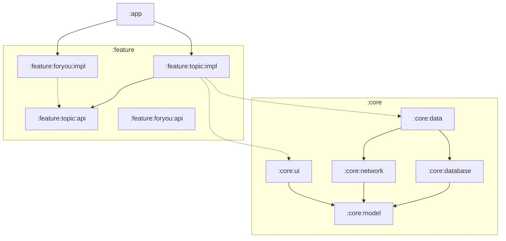

# Modularization Guide

Based on NowInAndroid's multi-module architecture strategy.

## Table of Contents
1. [Benefits](#benefits)
2. [Module Types](#module-types)
3. [Module Structure](#module-structure)
4. [Dependency Rules](#dependency-rules)
5. [Creating Modules](#creating-modules)

## Benefits

- **Scalability**: Changes in one module don't cascade to others
- **Parallel development**: Teams work independently on different modules
- **Build speed**: Incremental builds only recompile changed modules
- **Reusability**: Core modules can be shared across apps
- **Encapsulation**: Clear boundaries and visibility controls
- **Testability**: Each module can be tested in isolation

## Module Types

### App Module (`app/`)
Entry point that brings everything together.

**Contains**:
- `MainActivity`
- `NiaApp` composable
- `NiaNavHost` - app-level navigation
- `TopLevelDestination` - bottom nav setup

**Dependencies**: All feature modules, required core modules

### Feature Modules (`feature/`)
Self-contained features with two submodules:

```
feature/
  └── topic/
      ├── api/      # Public navigation keys
      └── impl/     # Internal implementation
```

**api module contains**:
- Navigation keys and route definitions
- Public navigation functions

**impl module contains**:
- Screen composables
- ViewModels
- UI state classes
- Hilt modules
- Internal navigation setup

### Core Modules (`core/`)
Shared library code used across features.

| Module | Purpose | Key Classes |
|--------|---------|-------------|
| `core:model` | Domain models (pure Kotlin) | `Topic`, `NewsResource`, `UserData` |
| `core:data` | Repositories, data coordination | `TopicsRepository`, `NewsRepository` |
| `core:database` | Room database, DAOs, entities | `NiaDatabase`, `TopicDao`, `TopicEntity` |
| `core:network` | Retrofit API, network models | `RetrofitNiaNetwork`, `NetworkTopic` |
| `core:datastore` | Proto DataStore preferences | `NiaPreferencesDataSource` |
| `core:common` | Shared utilities | `NiaDispatchers`, `Result` |
| `core:ui` | Reusable UI components | `NewsFeed`, `NewsResourceCard` |
| `core:designsystem` | Theme, icons, base components | `NiaTheme`, `NiaIcons`, `NiaButton` |
| `core:testing` | Test utilities, test doubles | `TestDispatcherRule`, `TestRepository` |

### Miscellaneous Modules

| Module | Purpose |
|--------|---------|
| `sync` | WorkManager sync implementation |
| `benchmark` | Performance testing |
| `app-nia-catalog` | Design system showcase app |

## Module Structure

### Feature Module Structure

```
feature/settings/
├── api/
│   ├── build.gradle.kts
│   └── src/main/kotlin/
│       └── com/example/feature/settings/api/
│           └── SettingsNavigation.kt    # Navigation keys
└── impl/
    ├── build.gradle.kts
    └── src/main/kotlin/
        └── com/example/feature/settings/impl/
            ├── SettingsScreen.kt        # UI
            ├── SettingsViewModel.kt     # State holder
            ├── SettingsUiState.kt       # State model
            ├── SettingsNavigation.kt    # Route setup
            └── di/
                └── SettingsModule.kt    # Hilt bindings
```

### Core Module Structure

```
core/data/
├── build.gradle.kts
└── src/
    ├── main/kotlin/
    │   └── com/example/core/data/
    │       ├── repository/
    │       │   ├── TopicsRepository.kt          # Interface
    │       │   └── OfflineFirstTopicsRepository.kt  # Implementation
    │       ├── model/
    │       │   └── Topic.kt                     # If needed
    │       └── di/
    │           └── DataModule.kt                # Hilt bindings
    └── test/kotlin/
        └── com/example/core/data/
            └── repository/
                └── TestTopicsRepository.kt      # Test double
```

## Dependency Rules

### Allowed Dependencies

```
app ──────────────► feature:*:impl
                    feature:*:api
                    core:*

feature:*:impl ───► feature:*:api (other features)
                    core:*

feature:*:api ────► core:model (only)

core:data ────────► core:database
                    core:network
                    core:model
                    core:datastore

core:database ────► core:model

core:network ─────► core:model

core:ui ──────────► core:model
                    core:designsystem

core:designsystem ► (no core dependencies)

core:model ───────► (no dependencies - pure Kotlin)
```

### Forbidden Dependencies

- **Feature → Feature impl**: Features must not depend on other feature implementations
- **Core → Feature**: Core modules never depend on features
- **Core → App**: Core modules never depend on app module
- **Model → Anything**: Model module has no dependencies

## Creating Modules

### 1. Feature Module (api)

`feature/myfeature/api/build.gradle.kts`:
```kotlin
plugins {
    alias(libs.plugins.nowinandroid.android.library)
    alias(libs.plugins.nowinandroid.hilt)
}

android {
    namespace = "com.example.feature.myfeature.api"
}

dependencies {
    api(projects.core.model)
}
```

`SettingsNavigation.kt`:
```kotlin
package com.example.feature.settings.api

import androidx.navigation.NavController

const val SETTINGS_ROUTE = "settings"

fun NavController.navigateToSettings() {
    navigate(SETTINGS_ROUTE)
}
```

### 2. Feature Module (impl)

`feature/myfeature/impl/build.gradle.kts`:
```kotlin
plugins {
    alias(libs.plugins.nowinandroid.android.feature)
    alias(libs.plugins.nowinandroid.android.library.compose)
}

android {
    namespace = "com.example.feature.myfeature.impl"
}

dependencies {
    api(projects.feature.myfeature.api)
    implementation(projects.core.data)
    implementation(projects.core.ui)
    implementation(projects.core.designsystem)
}
```

### 3. Core Library Module

`core/mycore/build.gradle.kts`:
```kotlin
plugins {
    alias(libs.plugins.nowinandroid.android.library)
    alias(libs.plugins.nowinandroid.hilt)
}

android {
    namespace = "com.example.core.mycore"
}

dependencies {
    implementation(projects.core.model)
    implementation(projects.core.common)
}
```

### 4. Register in settings.gradle.kts

```kotlin
include(":feature:myfeature:api")
include(":feature:myfeature:impl")
include(":core:mycore")
```

## Module Graph Visualization



## Best Practices

1. **Low coupling, high cohesion**: Similar code in same module, minimal dependencies between modules
2. **Use convention plugins**: Extract common build logic to `build-logic/`
3. **Avoid over-modularization**: Start simple, split when needed
4. **Keep core:model pure**: No Android dependencies, just data classes
5. **Feature isolation**: Features communicate only through navigation, not direct calls
6. **Test each module**: Every module should have its own test suite
